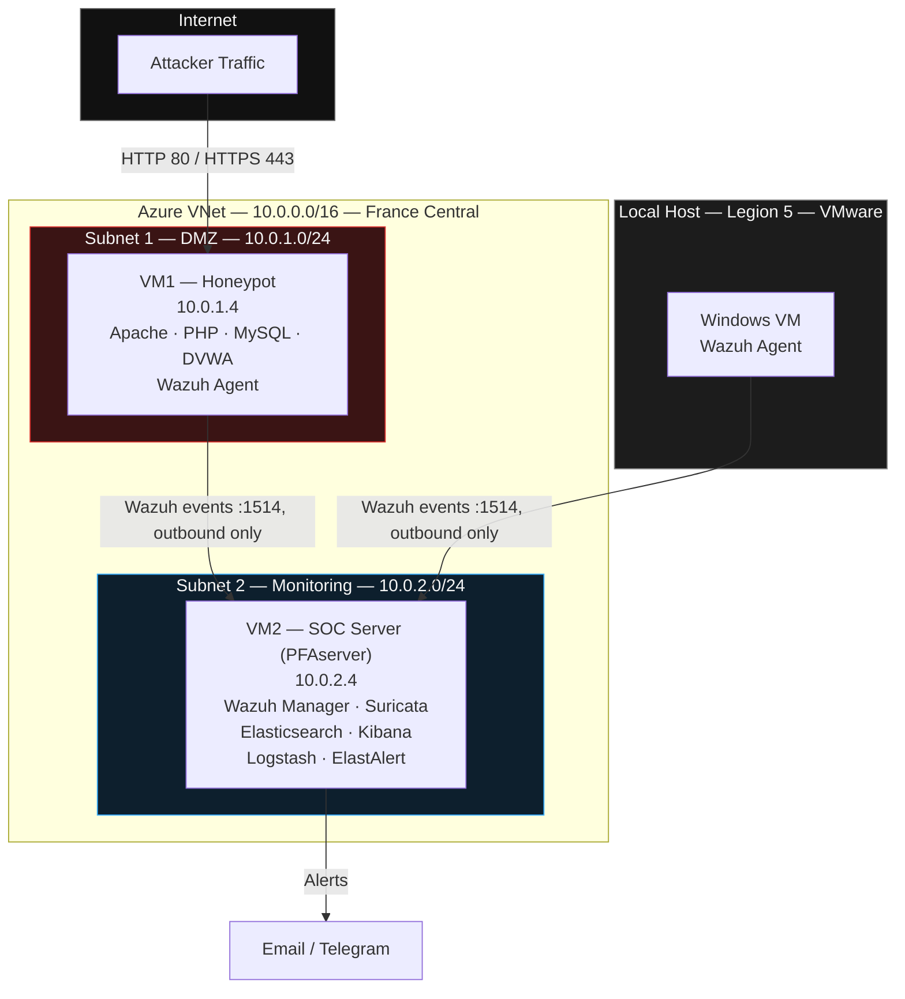
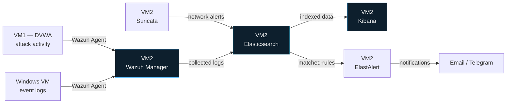
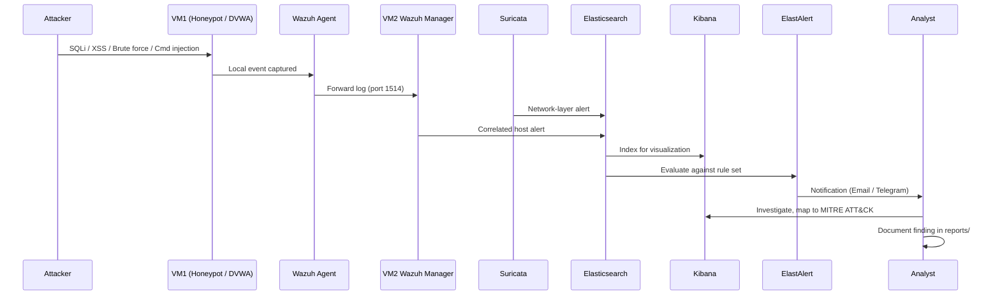
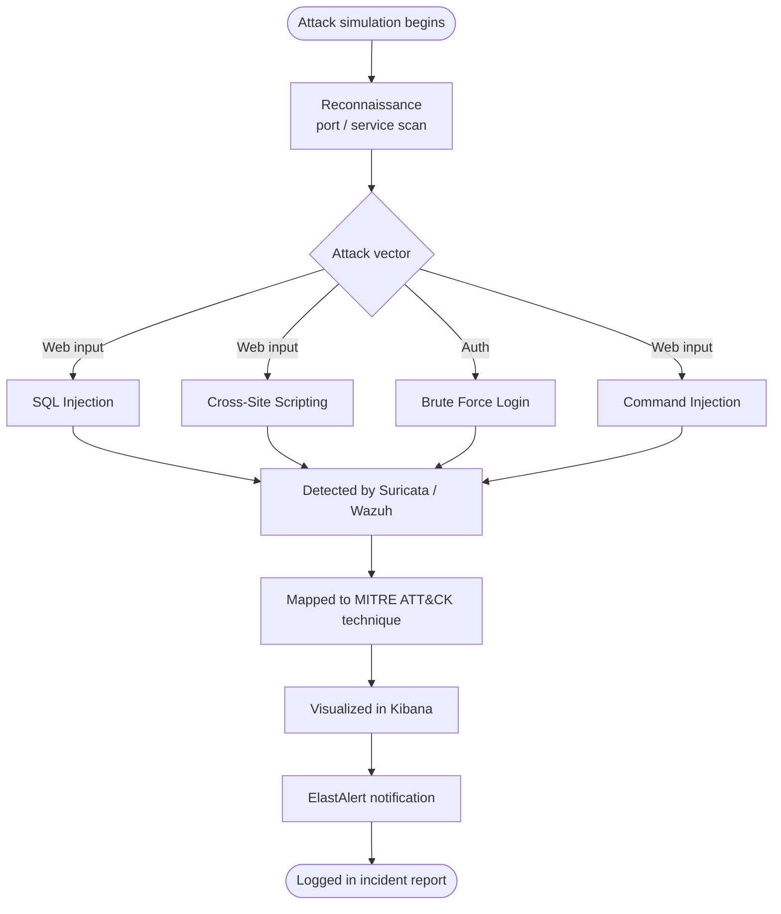
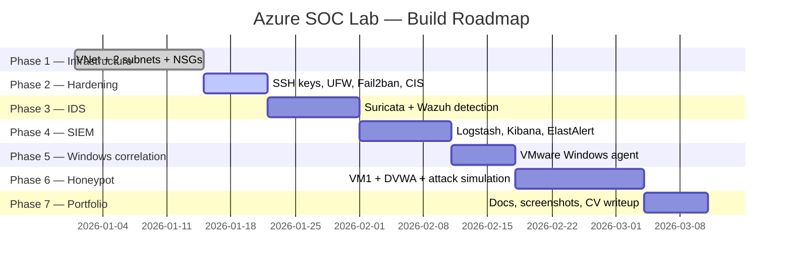

<div align="center">

# Azure SOC Lab

### A Cloud-Native Security Operations Center Built on Microsoft Azure

Network segmentation · SIEM · IDS · Threat detection · Cross-platform log correlation

<br/>


<br/>

[Overview](#overview) ·
[Architecture](#architecture-overview) ·
[Features](#features) ·
[Technologies](#technologies) ·
[Installation](#installation) ·
[Screenshots](#screenshots) ·
[MITRE ATT&CK](#mitre-attck-mapping) ·
[Roadmap](#project-roadmap) ·
[Docs](#documentation)

</div>

<br/>

---

## Overview

**Azure SOC Lab** is a self-contained Security Operations Center built end-to-end on Microsoft Azure, designed to reproduce — at small scale — the architecture of a real enterprise SOC: an internet-facing attack surface, an isolated monitoring plane, a SIEM/IDS pipeline, and cross-platform log correlation.

The environment is intentionally split across two network segments so that the exposed component (a honeypot) and the sensitive component (the monitoring stack) never share a broadcast domain or an inbound rule. A locally virtualized Windows host is folded into the same pipeline to demonstrate correlation of Linux and Windows telemetry inside a single SIEM.

> **This is a proof-of-concept / portfolio build.** In a production deployment, each service (SIEM, IDS, log store, alerting) would run on its own hardened host, with the honeypot fully isolated in its own trust zone, dedicated logging infrastructure, and a managed key vault instead of local secrets.

**What this project demonstrates:**

| Domain | Applied skill |
|---|---|
| Cloud networking | Azure VNet design, subnetting, NSG rule engineering |
| Defensive security | SIEM/IDS deployment, detection engineering, alert triage |
| Threat emulation | DVWA-based attack simulation (SQLi, XSS, brute force, command injection) |
| Detection mapping | MITRE ATT&CK technique tagging for observed attacks |
| Systems hardening | CIS Benchmark application, SSH hardening, Fail2ban, UFW |
| Cross-platform ops | Windows + Linux log correlation in a single pane of glass |

<br/>

## Architecture Overview

The lab runs two Azure subnets inside a single VNet, plus a locally hosted Windows VM that participates in the same log pipeline over an outbound-only connection.



**Design principle:** the honeypot subnet accepts inbound traffic from the internet; the monitoring subnet accepts nothing from the internet at all. The only path between the two is a single outbound Wazuh agent connection on port 1514, initiated by the honeypot — never the reverse.

<details>
<summary><strong>Network reference table</strong></summary>
<br/>

| Component | Location | IP range | Internet access |
|---|---|---|---|
| Azure VNet | France Central | `10.0.0.0/16` | Contained |
| Subnet 1 — DMZ | Azure VNet | `10.0.1.0/24` | Yes — exposed |
| Subnet 2 — Monitoring | Azure VNet | `10.0.2.0/24` | No — internal only |
| VM1 — Honeypot | Subnet 1 | `10.0.1.4` | Yes — attacker-facing |
| VM2 — SOC Server | Subnet 2 | `10.0.2.4` | No — hidden |
| Windows VM (VMware) | Local (Legion 5) | Local only | No — sends logs only |

</details>

<details>
<summary><strong>VM specifications</strong></summary>
<br/>

**VM1 — Honeypot (DMZ Subnet)**

| Parameter | Value |
|---|---|
| Size | B1s — 1 vCPU, 1 GB RAM |
| OS | Ubuntu Server 24.04 LTS |
| Disk | Standard SSD, 32 GB |
| Public IP | Static |
| Stack | Apache2 + PHP + MySQL + DVWA + Wazuh Agent |
| NSG | Allow 80/443 from internet · Allow 22 from admin IP only |

**VM2 — SOC Server "PFAserver" (Monitoring Subnet)**

| Parameter | Value |
|---|---|
| Size | B2as_v2 — 2 vCPU, 8 GB RAM |
| OS | Ubuntu Server 24.04 LTS |
| Disk | Standard SSD, 64 GB |
| Public IP | Static, SSH management only |
| Stack | Wazuh Manager + Suricata + Elasticsearch + Kibana + Logstash + ElastAlert |
| NSG | Allow 22/5601 from admin IP only · All other inbound internet traffic blocked |

**Windows VM (VMware Workstation, local)**

| Parameter | Value |
|---|---|
| Host | Legion 5 — Ryzen/i7, 16 GB RAM, RTX 3050 Ti |
| Spec | 4 vCPU, 4 GB RAM, 60 GB disk |
| OS | Windows 10 Pro or Windows Server 2019 |
| Role | Cross-platform log correlation |
| Security | No inbound ports — outbound to VM2 only |

</details>

<br/>

## Log Collection Pipeline



## Detection & Incident Response Workflow



## Attack Flow (Honeypot Simulation)



<br/>

## Features

- **Real network segmentation** — internet-facing DMZ and internal monitoring plane on separate subnets with independent NSGs, not a single flat network.
- **Layered detection** — host-based (Wazuh) and network-based (Suricata) detection feeding a shared index.
- **Centralized SIEM** — Elasticsearch + Kibana + Logstash pipeline with dashboards for attack maps, timelines, and top source IPs.
- **Automated alerting** — ElastAlert rules push notifications on matched detection criteria.
- **Cross-platform correlation** — Windows Event Log telemetry correlated against Linux host and network telemetry in one view.
- **Deliberately vulnerable target** — DVWA-based honeypot for controlled, repeatable attack simulation.
- **MITRE ATT&CK mapping** — every simulated attack is tagged to its corresponding technique.
- **Hardened management plane** — key-based SSH only, UFW, Fail2ban, and CIS Benchmark Level 1 applied to the SOC server.

## Technologies

<div align="center">


</div>

## Repository Structure

```text
Azure-soc-lab/
├── README.md                  Project overview (this file)
├── LICENSE                    MIT License
├── CHANGELOG.md                Version history
├── CONTRIBUTING.md            Contribution guidelines
├── SECURITY.md                 Vulnerability reporting policy
├── CODE_OF_CONDUCT.md          Community standards
├── .gitignore
├── .github/
│   ├── workflows/markdown-lint.yml    CI: markdown lint on push/PR
│   ├── ISSUE_TEMPLATE/                Bug report + feature request forms
│   └── PULL_REQUEST_TEMPLATE.md
├── docs/                       Deep-dive documentation (see below)
├── azure/                      VNet, subnet, NSG, VM deployment assets
├── wazuh/                      Wazuh manager + agent configuration
├── suricata/                   Suricata rules and configuration
├── elastic/                    Elasticsearch + Kibana configuration
├── logstash/                   Logstash pipeline definitions
├── elastalert/                 ElastAlert rule definitions
├── windows-agent/              Windows Wazuh agent setup
├── honeypot/                   DVWA honeypot deployment assets
├── scripts/                    Setup / hardening / automation scripts
├── screenshots/                Dashboard and evidence screenshots
└── reports/                    Attack simulation & incident reports
```

Every subdirectory contains its own `README.md` describing its purpose, contents, configuration files, and usage — see [Documentation](#documentation) below.

<br/>

## Project Roadmap



<details>
<summary><strong>Detailed task breakdown by phase</strong></summary>
<br/>

**Phase 1 — Azure Infrastructure**

| Task | Status |
|---|---|
| Deploy Azure VM2 (B2as_v2, Ubuntu 24.04, France Central) | Done |
| Add 2 GB swap memory | Done |
| Optimize Elasticsearch heap (3 GB) | Done |
| Configure SSH key access | Done |
| Design VNet with 2 subnets (DMZ + Monitoring) | Medium |
| Configure NSG rules for both subnets | Medium |
| Move VM2 to Subnet 2 (Monitoring) | Medium |

**Phase 2 — Server Hardening**

| Task | Difficulty |
|---|---|
| Disable SSH password — key-based auth only | Easy |
| Configure UFW firewall — open only needed ports | Easy |
| Install + configure Fail2ban | Easy |
| Apply CIS Benchmark Level 1 | Medium |
| Test hardening — brute force + verify blocked | Medium |
| Document with before/after screenshots | Easy |

**Phase 3 — IDS Configuration**

| Task | Difficulty |
|---|---|
| Configure Suricata rules for attack detection | Medium |
| Configure Wazuh manager + detection rules | Hard |
| Install + configure Filebeat pipeline | Medium |
| Integrate Wazuh + Suricata → Elasticsearch | Hard |
| Test IDS — verify alerts appear in Kibana | Medium |

**Phase 4 — SIEM & Dashboards**

| Task | Difficulty |
|---|---|
| Configure Logstash pipelines for all log sources | Hard |
| Build Kibana dashboards — attack map, timeline, top IPs | Hard |
| Configure ElastAlert detection rules | Hard |
| Test full pipeline — log → detect → dashboard → alert | Medium |

**Phase 5 — Windows Correlation**

| Task | Difficulty |
|---|---|
| Create Windows VM on VMware (4 vCPU, 4 GB RAM) | Easy |
| Install Wazuh agent on Windows VM | Easy |
| Connect Windows VM to Wazuh Manager (VM2) | Medium |
| Verify Windows logs appear in Kibana | Medium |
| Build cross-platform correlation dashboard | Hard |

**Phase 6 — Honeypot (VM1)**

| Task | Difficulty |
|---|---|
| Create VM1 (B1s, 32 GB, Subnet 1 DMZ) | Easy |
| Install Apache + PHP + MySQL + DVWA | Easy |
| Configure VM1 NSG — expose HTTP/HTTPS to internet | Medium |
| Install Wazuh agent on VM1 → connect to VM2 | Medium |
| Verify DVWA attacks detected by Wazuh + Suricata | Medium |
| Simulate attacks — SQLi, XSS, brute force, cmd injection | Medium |
| Map attacks to MITRE ATT&CK framework | Hard |

**Phase 7 — CV & Portfolio**

| Task | Difficulty |
|---|---|
| Create GitHub repo — upload all configs and scripts | Easy |
| Write README — architecture, tools, screenshots | Medium |
| Take professional Kibana dashboard screenshots | Easy |
| Write CV project description | Medium |
| Record short demo video (optional) | Medium |

</details>

<br/>

## Installation

> **Prerequisite:** an Azure subscription (Student credit is sufficient — see [cost notes](#cost-notes) below), a local hypervisor for the Windows correlation VM, and basic familiarity with Linux administration.

<details>
<summary><strong>1. Provision the network</strong></summary>
<br/>

```bash
# Resource group + VNet
az group create --name <TO_BE_COMPLETED> --location francecentral
az network vnet create \
  --resource-group <TO_BE_COMPLETED> \
  --name soc-vnet \
  --address-prefix 10.0.0.0/16 \
  --subnet-name dmz-subnet \
  --subnet-prefix 10.0.1.0/24

az network vnet subnet create \
  --resource-group <TO_BE_COMPLETED> \
  --vnet-name soc-vnet \
  --name monitoring-subnet \
  --address-prefix 10.0.2.0/24
```

See [`docs/networking.md`](docs/networking.md) and [`docs/nsg-rules.md`](docs/nsg-rules.md) for the full NSG rule set.
</details>

<details>
<summary><strong>2. Deploy VM2 — SOC Server</strong></summary>
<br/>

```bash
az vm create \
  --resource-group <TO_BE_COMPLETED> \
  --name PFAserver \
  --vnet-name soc-vnet --subnet monitoring-subnet \
  --size Standard_B2as_v2 \
  --image Ubuntu2404 \
  --admin-username <TO_BE_COMPLETED> \
  --ssh-key-values <TO_BE_COMPLETED>
```

Then follow [`docs/vm-deployment.md`](docs/vm-deployment.md), [`docs/wazuh.md`](docs/wazuh.md), [`docs/suricata.md`](docs/suricata.md), and [`docs/elastic-stack.md`](docs/elastic-stack.md) in order.
</details>

<details>
<summary><strong>3. Deploy VM1 — Honeypot</strong></summary>
<br/>

```bash
az vm create \
  --resource-group <TO_BE_COMPLETED> \
  --name honeypot-vm \
  --vnet-name soc-vnet --subnet dmz-subnet \
  --size Standard_B1s \
  --image Ubuntu2404 \
  --public-ip-sku Standard
```

Then follow [`docs/dvwa.md`](docs/dvwa.md) and [`honeypot/README.md`](honeypot/README.md).
</details>

<details>
<summary><strong>4. Connect the Windows correlation VM</strong></summary>
<br/>

Follow [`docs/windows-agent.md`](docs/windows-agent.md) and [`windows-agent/README.md`](windows-agent/README.md) to build the VMware VM and register its Wazuh agent against VM2.
</details>

<details>
<summary><strong>5. Verify the pipeline</strong></summary>
<br/>

1. Trigger a test alert on VM1 (see [`docs/attack-simulation.md`](docs/attack-simulation.md)).
2. Confirm the event appears in Kibana within the expected latency window.
3. Confirm ElastAlert delivers a notification.
4. Log the result in [`reports/`](reports/).
</details>

<br/>

## Screenshots

> Screenshots are intentionally omitted from this template and will be added as the environment is built and verified. See [`screenshots/README.md`](screenshots/README.md) for the capture checklist and naming convention.

| Dashboard | Description |
|---|---|
| `<TO_BE_COMPLETED>` | Kibana attack map |
| `<TO_BE_COMPLETED>` | Alert timeline |
| `<TO_BE_COMPLETED>` | Top source IPs |
| `<TO_BE_COMPLETED>` | Cross-platform correlation view |

## MITRE ATT&CK Mapping

Every attack simulated against the honeypot is mapped to its corresponding MITRE ATT&CK technique as part of the detection workflow.

| Simulated attack | Tactic | Technique (placeholder — confirm per test) |
|---|---|---|
| SQL Injection | Initial Access / Collection | `<TO_BE_COMPLETED>` |
| Cross-Site Scripting (XSS) | Initial Access | `<TO_BE_COMPLETED>` |
| Brute Force Login | Credential Access | `<TO_BE_COMPLETED>` |
| Command Injection | Execution | `<TO_BE_COMPLETED>` |

Full mapping methodology in [`docs/mitre-mapping.md`](docs/mitre-mapping.md).

## Cost Notes

Built entirely on an Azure Student credit using a two-phase spending plan so the honeypot (always-on) is only provisioned during the attack-simulation phase.

| Phase | Configuration | Monthly cost |
|---|---|---|
| Phases 1–5 | VM2 only, 5 hrs/day | ~$22/month |
| Phase 6 | VM1 + VM2, VM1 24/7 | ~$36/month |
| Phase 7 | VM2 only | ~$22/month |

Total estimated spend across the ~10-week build: **~$78** against a **$99** Azure Student credit.

> **Golden rule:** always stop/deallocate VM2 when not actively working. VM1 runs 24/7 only during the active honeypot phase, since it must stay reachable to attract traffic.

## Documentation

| Page | Covers |
|---|---|
| [`docs/azure-setup.md`](docs/azure-setup.md) | Subscription, resource group, region selection |
| [`docs/networking.md`](docs/networking.md) | VNet and subnet design |
| [`docs/nsg-rules.md`](docs/nsg-rules.md) | Full NSG rule reference |
| [`docs/vm-deployment.md`](docs/vm-deployment.md) | VM1 / VM2 provisioning |
| [`docs/wazuh.md`](docs/wazuh.md) | Wazuh manager + agent setup |
| [`docs/suricata.md`](docs/suricata.md) | Suricata rules and tuning |
| [`docs/elastic-stack.md`](docs/elastic-stack.md) | Elasticsearch, Logstash, Kibana |
| [`docs/windows-agent.md`](docs/windows-agent.md) | Windows VM + Wazuh agent |
| [`docs/dvwa.md`](docs/dvwa.md) | Honeypot / DVWA deployment |
| [`docs/dashboards.md`](docs/dashboards.md) | Kibana dashboard build notes |
| [`docs/attack-simulation.md`](docs/attack-simulation.md) | Attack test procedures |
| [`docs/mitre-mapping.md`](docs/mitre-mapping.md) | ATT&CK mapping methodology |
| [`docs/lessons-learned.md`](docs/lessons-learned.md) | Retrospective notes |
| [`docs/troubleshooting.md`](docs/troubleshooting.md) | Common issues and fixes |

## Future Improvements

- Move each SIEM component to its own dedicated host to mirror a real production topology.
- Replace static NSG allow-lists with Azure Bastion for management access.
- Add automated infrastructure provisioning (Terraform/Bicep) in place of manual `az` commands.
- Integrate a secrets manager (Azure Key Vault) instead of local credential files.
- Expand the honeypot to additional services (SSH, FTP) for broader attacker telemetry.
- Add a SOAR-style automated response layer (e.g., auto-block source IP after N failed logins).

## Skills Demonstrated

`Azure Networking` · `NSG / Firewall Design` · `Linux Server Hardening` · `CIS Benchmarking` · `SIEM Engineering (Wazuh)` · `Network IDS (Suricata)` · `Elastic Stack Administration` · `Log Pipeline Design (Logstash)` · `Alert Engineering (ElastAlert)` · `Windows Event Log Analysis` · `Cross-Platform Correlation` · `Attack Simulation` · `MITRE ATT&CK Mapping` · `Incident Documentation`

## References

- [Microsoft Azure Documentation](https://learn.microsoft.com/en-us/azure/)
- [Wazuh Documentation](https://documentation.wazuh.com/)
- [Suricata User Guide](https://docs.suricata.io/)
- [Elastic Stack Documentation](https://www.elastic.co/guide/index.html)
- [DVWA — Damn Vulnerable Web Application](https://github.com/digininja/DVWA)
- [MITRE ATT&CK Framework](https://attack.mitre.org/)
- [CIS Benchmarks](https://www.cisecurity.org/cis-benchmarks)

## License

Distributed under the MIT License. See [`LICENSE`](LICENSE) for details.

---

<div align="center">

Built solo by **Awfa** as a hands-on cybersecurity portfolio project.

</div>
