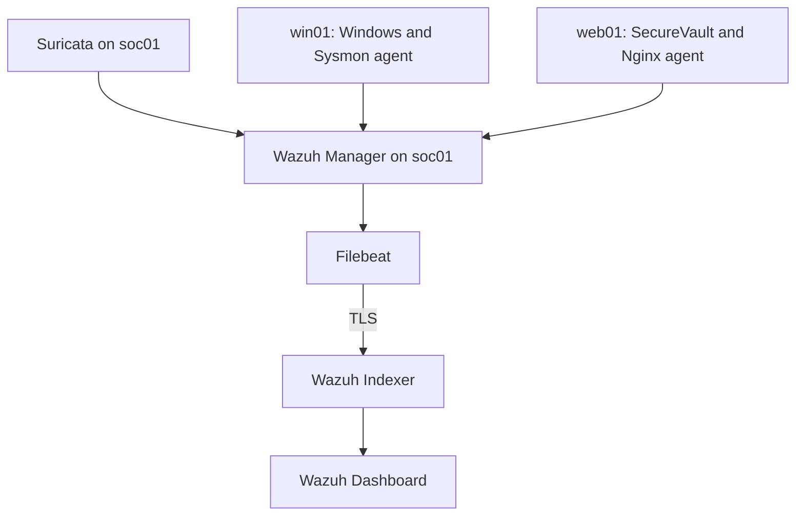

# Azure SOC Lab · SecureVault

**Cloud security monitoring from network traffic to application activity**

Microsoft Azure · Wazuh · Suricata · Sysmon · Laravel · Angular · MySQL

**Awfa Abdulkader** | PFA 2025–2026 | EMSI Tanger · LTRA TECH

[Architecture](docs/architecture.md) · [Six project phases](docs/implementation.md) · [Evidence gallery](screenshots/README.md) · [Project report — French](reports/PFA-SOC-Azure-SecureVault-2026.pdf)

## Overview

An Azure-hosted SOC prototype that brings Linux, network, Windows, and application security events into one investigation workflow. The project combines a hardened Ubuntu SOC server, Suricata network detection, Windows telemetry from Sysmon, and **SecureVault**, a document storage and controlled-sharing application.

The goal is to trace an event from its original log through collection, detection, indexing, and investigation—not just to show an installed dashboard.

> This repository publishes the project documentation, report, diagrams, and lab evidence. SecureVault application source code, live credentials, exported production configurations, and automated deployment scripts are not included. The environment was validated as an academic lab; it is not a production SOC or a CIS certification.

```mermaid
flowchart TD
    N["Suricata on soc01"] --> M["Wazuh Manager on soc01"]
    W["win01: Windows and Sysmon agent"] --> M
    V["web01: SecureVault and Nginx agent"] --> M
    M --> F["Filebeat"]
    F -->|TLS| I["Wazuh Indexer"]
    I --> D["Wazuh Dashboard"]
```

[Supplied architecture illustrations](docs/visuals.md) include conceptual variations; the flow above follows the final report’s placement of Suricata on soc01.

## What was built

| Component | Role |
|---|---|
| **soc01** · Ubuntu | Wazuh Manager, Filebeat, Wazuh Indexer, Wazuh Dashboard, and Suricata |
| **win01** · Windows | Wazuh agent, Windows event collection, and Sysmon telemetry |
| **web01** · Ubuntu | SecureVault, Nginx, PHP-FPM, MySQL, and Wazuh agent |
| **Azure networking** | Private VM communication, subnet separation, and NSG filtering |
| **Host protection** | SSH restrictions, UFW, Fail2ban, secure mounts, and CIS-based auditing |

The implemented stack uses **Wazuh Indexer and Wazuh Dashboard**. DVWA, standalone Kibana/Logstash, and ElastAlert belonged to the earlier repository plan and are not presented as completed components here.

## Results and evidence

| Area | Documented result | Evidence |
|---|---|---|
| Linux hardening | CIS failed checks reduced **106 → 6 → 5**; five findings remain | [Hardening](docs/hardening.md) |
| Network detection | Controlled traffic triggered Suricata **SID 2100498**, then reached Wazuh | [Suricata screenshots](screenshots/phase-03-suricata/README.md) |
| Alert transport | Filebeat-to-Indexer TLS connection validated | [Pipeline](docs/architecture.md) |
| Windows monitoring | Sysmon process and network events indexed, including port 5985 context | [Windows screenshots](screenshots/phase-05-windows/README.md) |
| SecureVault monitoring | Authentication, document activity, Nginx events, and FIM captured in lab evidence | [SecureVault](docs/securevault.md) |
| Investigation | Source-specific dashboards and cross-platform views | [Dashboard screenshots](screenshots/phase-04-dashboards/README.md) |

Results describe the supplied report and historical lab captures, not a new live test of the Azure environment. A security alert alone does not prove compromise.

## SecureVault

SecureVault provides document organization, controlled sharing with expiry and revocation, download limits, account administration, and activity history. Its structured security log gives the SOC application context alongside operating-system and network telemetry.

[Application gallery](screenshots/securevault-demo/README.md) · [UML and diagrams](docs/visuals.md) · [Monitoring design](docs/securevault.md)

## Project phases

1. **Azure infrastructure:** establish the network and central Wazuh services.
2. **Linux hardening:** apply layered controls and track remaining CIS findings.
3. **Network detection:** integrate Suricata EVE JSON with Wazuh.
4. **SIEM investigation:** validate transport, rules, searches, and dashboards.
5. **Windows monitoring:** connect win01 and collect Windows/Sysmon events.
6. **SecureVault integration:** deploy web01 and monitor application activity and files.

[Read the implementation walkthrough](docs/implementation.md).

## Explore the repository

| Path | Contents |
|---|---|
| [docs/](docs/README.md) | Architecture, implementation, hardening, validation, and lessons learned |
| [assets/](docs/visuals.md) | Architecture diagrams, UML, and supplied charts |
| [screenshots/](screenshots/README.md) | Evidence organized by phase, with expandable previews |
| [reports/](reports/README.md) | Original final PFA report in French |
| [CHANGELOG.md](CHANGELOG.md) | Documentation update and scope changes |

## Limitations and next steps

- The all-in-one SOC host is a lab design and a single point of failure.
- Suricata visibility is limited to traffic reaching its monitored interface; this does not establish visibility over every Azure VM flow.
- Five CIS findings remain; dashboard counts and supplied charts are lab observations, not detection-rate or compliance metrics.
- SQLmap, Nmap, or login-test screenshots alone do not establish an exploitable vulnerability.
- Suggested next steps: infrastructure as code, reviewed configuration exports, backup/restore testing, retention planning, and dedicated secrets management.

[Validation and interpretation](docs/validation.md) · [Lessons learned](docs/lessons-learned.md)

## Author and license

**Awfa Abdulkader** — [GitHub](https://github.com/awfaabdulkader)

The existing [MIT license](LICENSE) is preserved.
