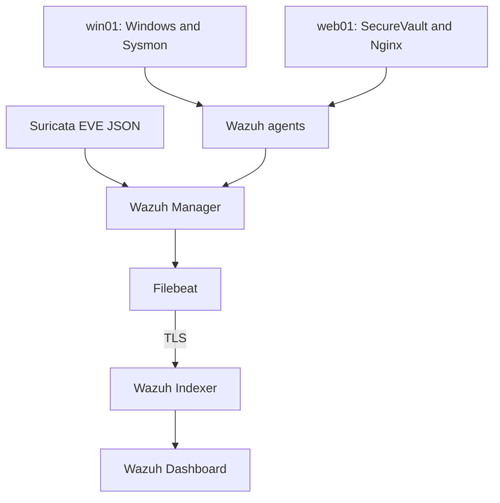

# Architecture

[Back to overview](../README.md)

The final report describes resource group `azure-soc-rg` in France Central and VNet `soc-vnet` (`10.0.0.0/16`). These names and private addresses describe the historical lab, not parameters for an automated deployment.

| Host | Reported private address | Workload |
|---|---|---|
| soc01 | 10.0.2.4 | Ubuntu 24.04.4 LTS; Wazuh central services, Filebeat, Suricata |
| win01 | 10.0.0.4 | Windows, Wazuh agent, Sysmon |
| web01 | Not fixed in this documentation | Ubuntu; Nginx, Angular, Laravel/PHP-FPM, MySQL, Wazuh agent |

## Collection and investigation

Suricata produces network events in `eve.json`. Wazuh collects and analyzes them. Agents add Windows and web-server telemetry. Filebeat forwards generated alerts to the Indexer; analysts investigate through the Dashboard.

## Network boundaries

NSGs restrict Azure access; host firewalls add a separate control. Administrative access is restricted by source. During the SecureVault demonstration, web access was also limited to the authorized source: failure from another connection was not automatically an application fault. Diagnose both subnet and NIC NSGs alongside the local firewall.

A Suricata sensor on soc01 does not automatically inspect all traffic between other Azure VMs. The supplied controlled HTTP test proves the observed sensor path only. The web01 agent independently provides application and host visibility.

[Architecture illustrations](visuals.md) · Source: final report, sections 3.2–3.9.
