# Architecture, UML, and charts

[Back to overview](../README.md)

Supplied illustrations, preserved at original resolution. **Topology note:** the supplied global illustration places Suricata on the web server, whereas report §3.2–3.3 describes Suricata on soc01. Use the [report-aligned architecture](architecture.md) as the deployment reference; these drawings are conceptual and may represent different iterations. Charts describe the lab captures; raw datasets were not supplied.

### GLOBAL ARCHITECTURE OF THE AZURE SOC

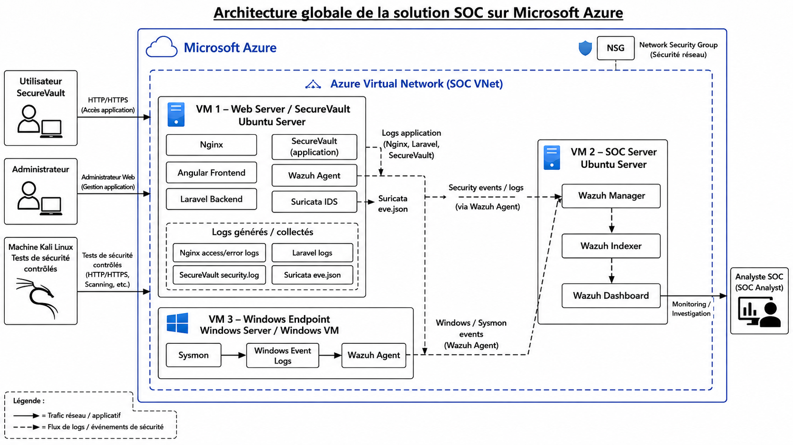

### SecureVault SOC Integration Architecture

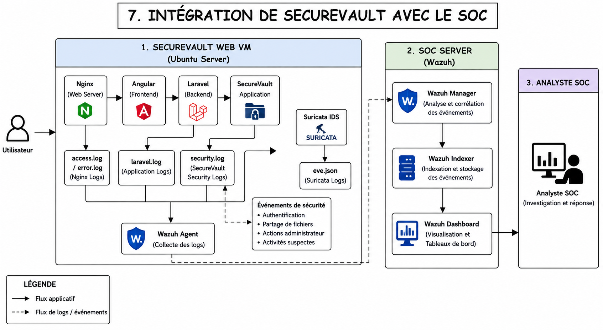

### Security Detection and Investigation Chain

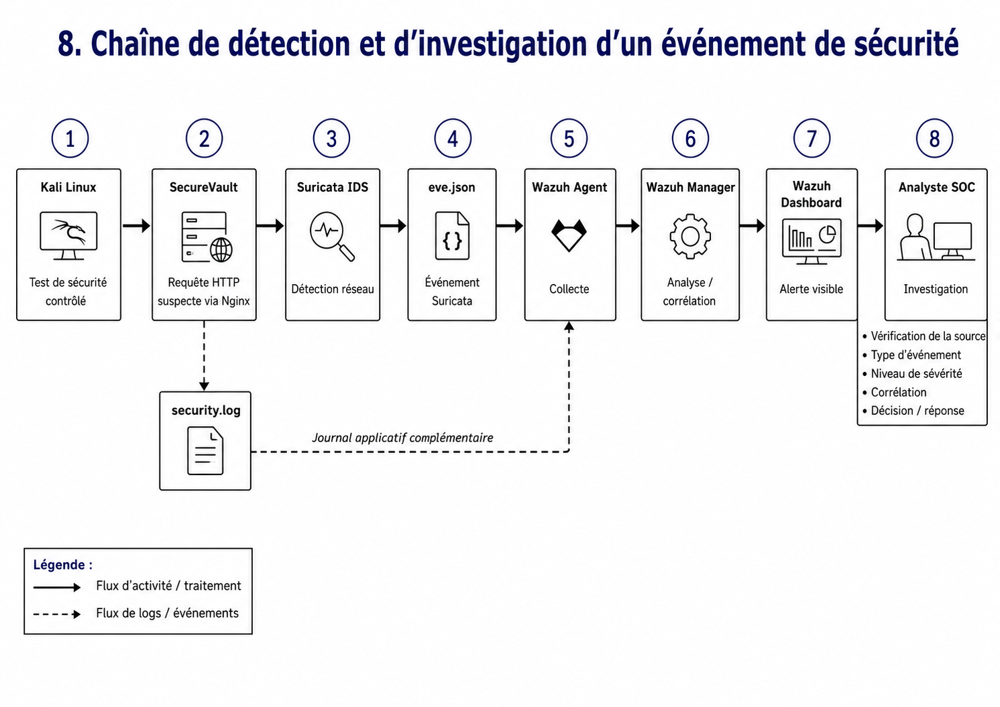

### Security Log Collection and Monitoring Flow

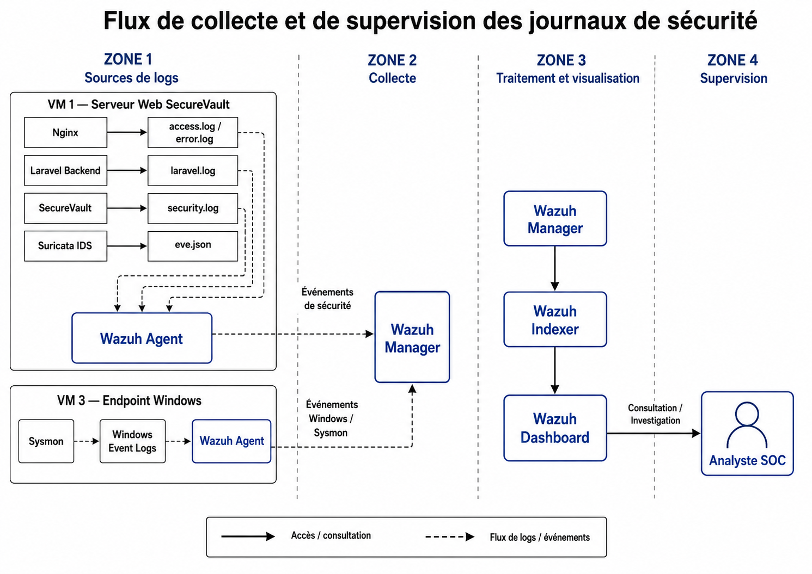

### Suricata–Wazuh Detection Flow Diagram

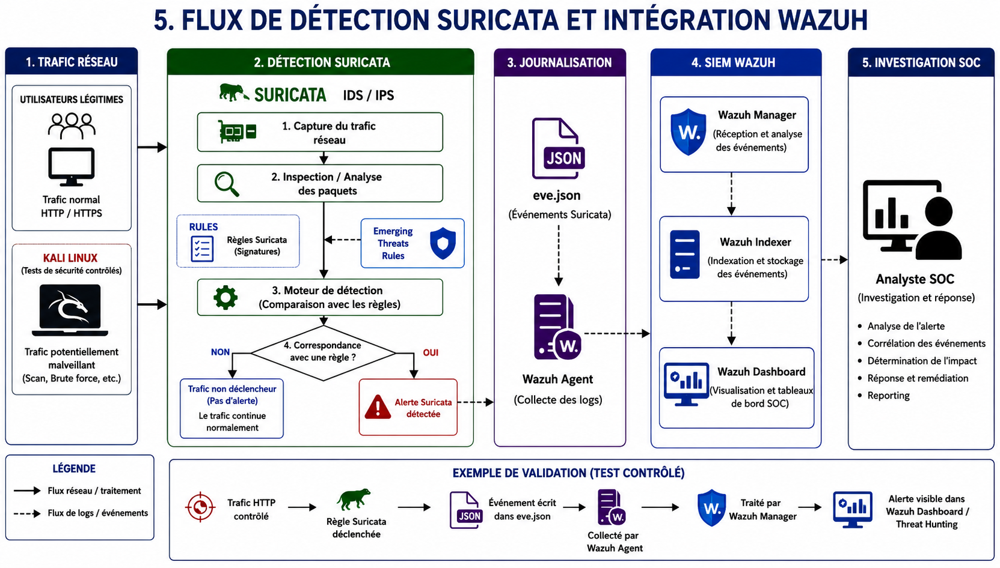

### Wazuh Event Processing Flow Diagram

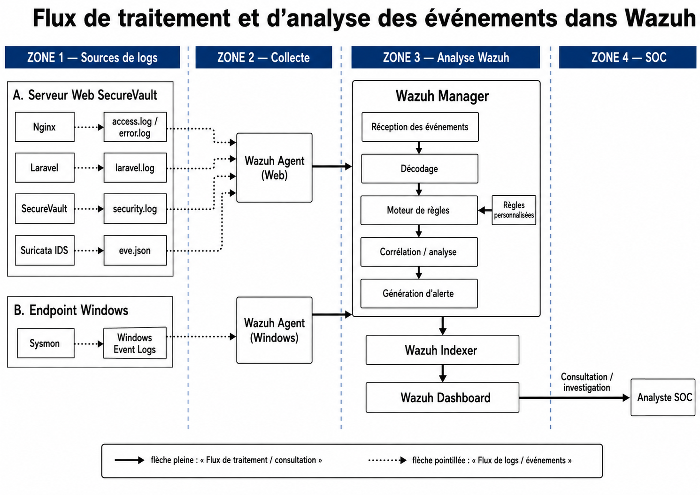

### Windows SOC Monitoring Pipeline with Sysmon and Wazuh

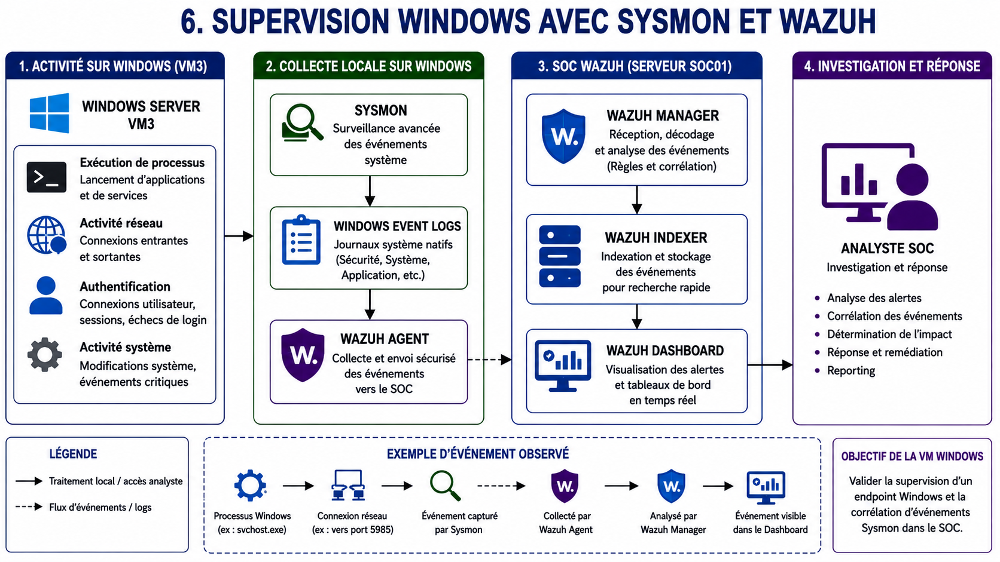

### architecture reseau azuur

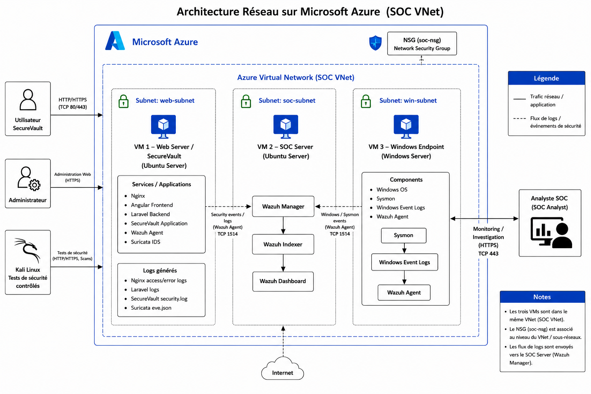

### Diagramme de séquence du partage sécurisé

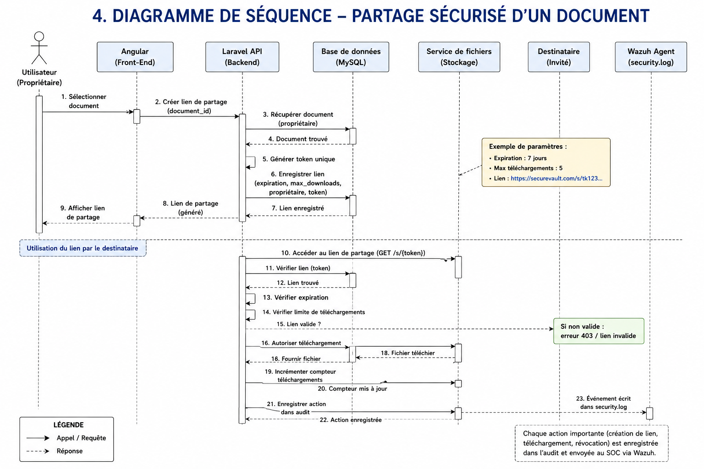

### SecureVault SOC Deployment Diagram

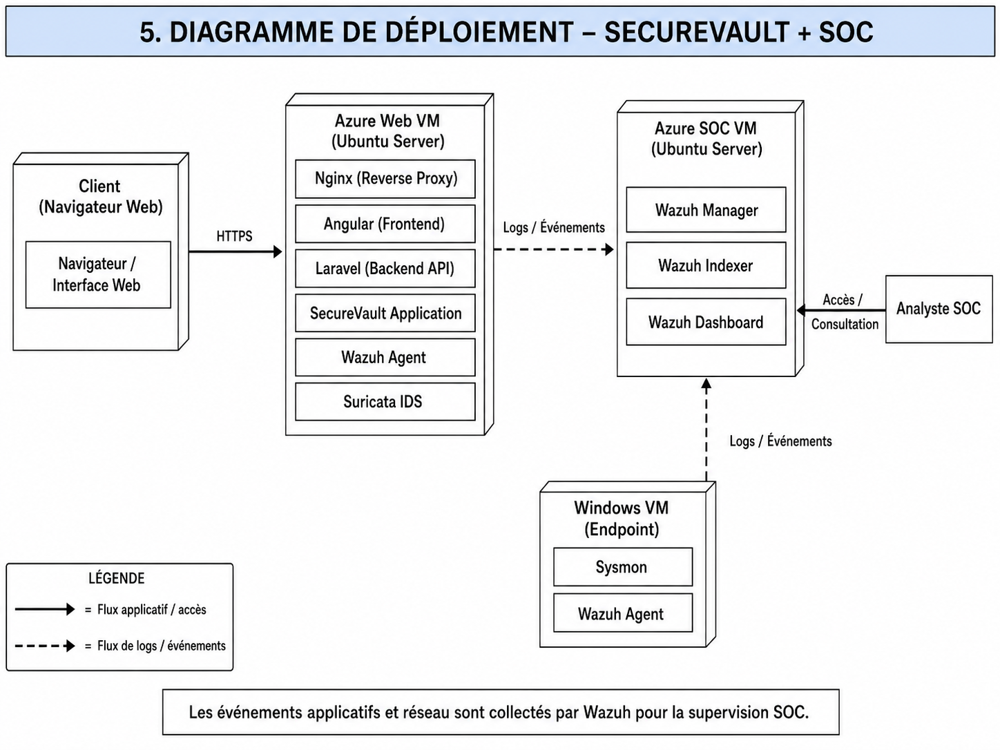

### SecureVault UML Class Diagram

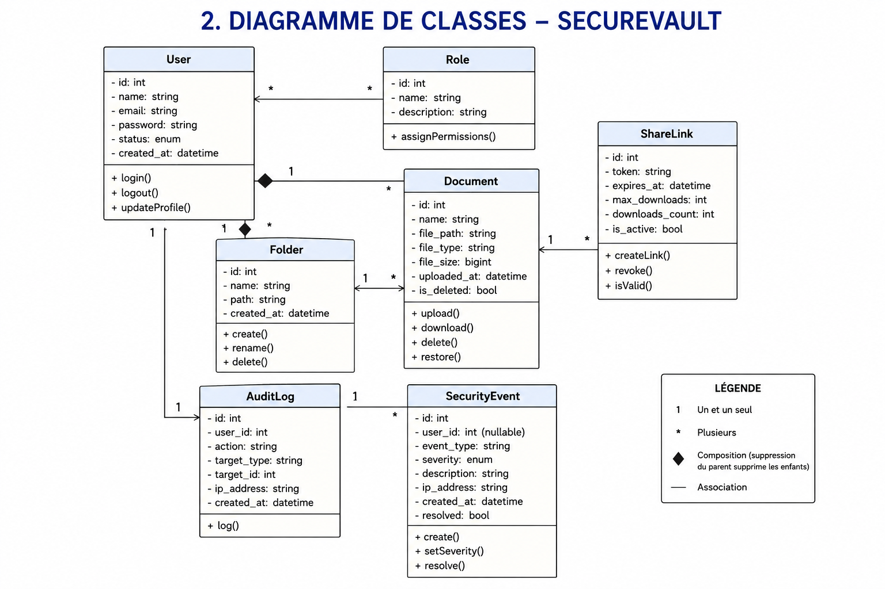

### SecureVault Use Case Diagram

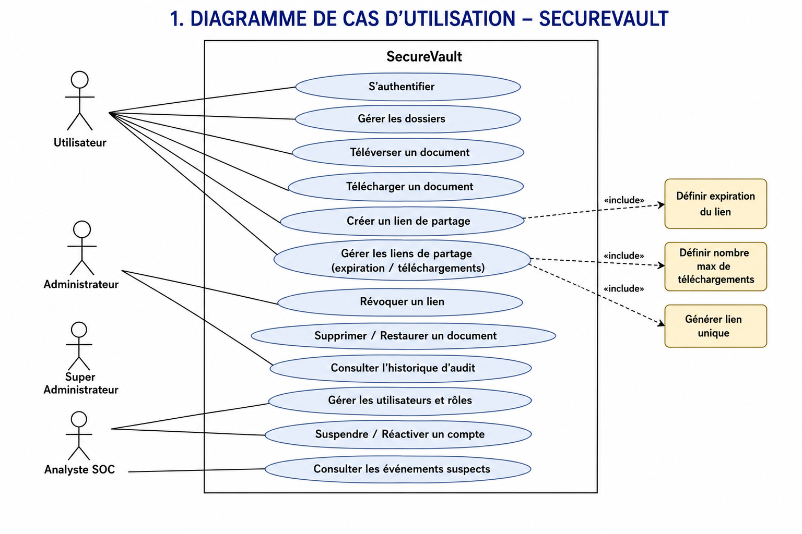

### Séquence d’authentification SecureVault

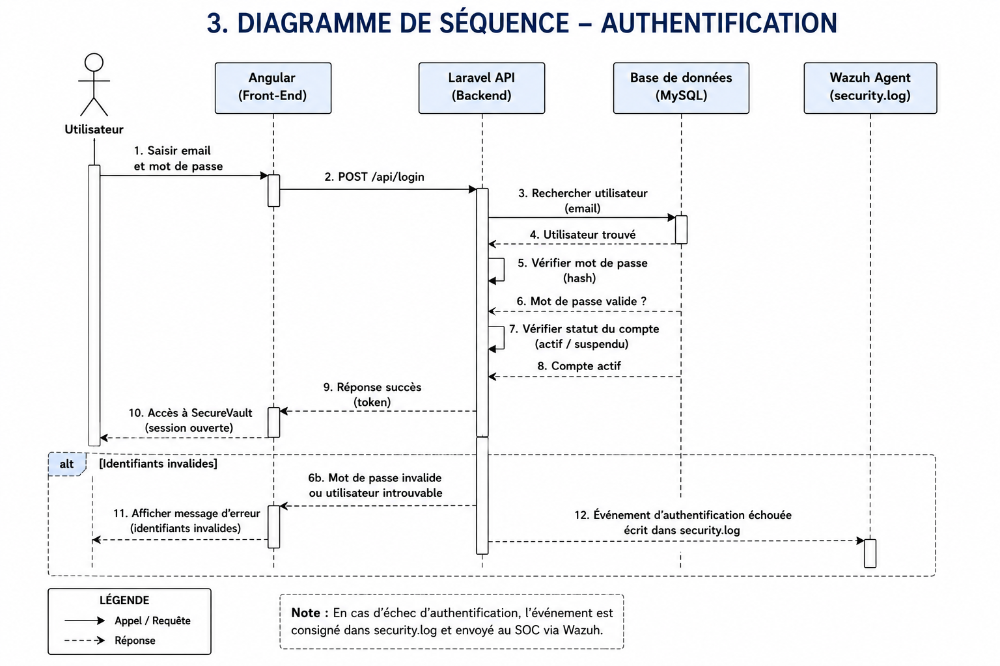

### Indicateurs de sécurité SecureVault

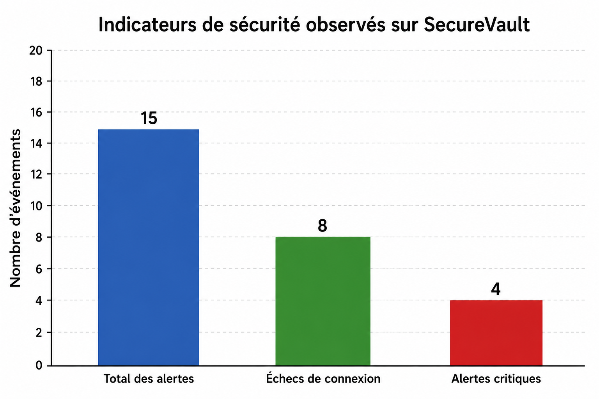

### Événements FIM détectés sur SecureVault

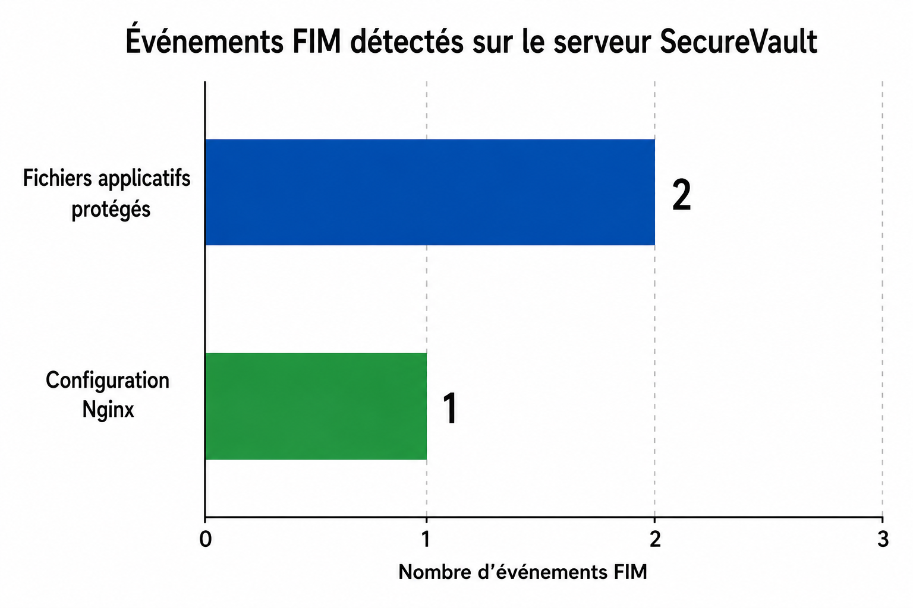

### Événements de sécurité SecureVault

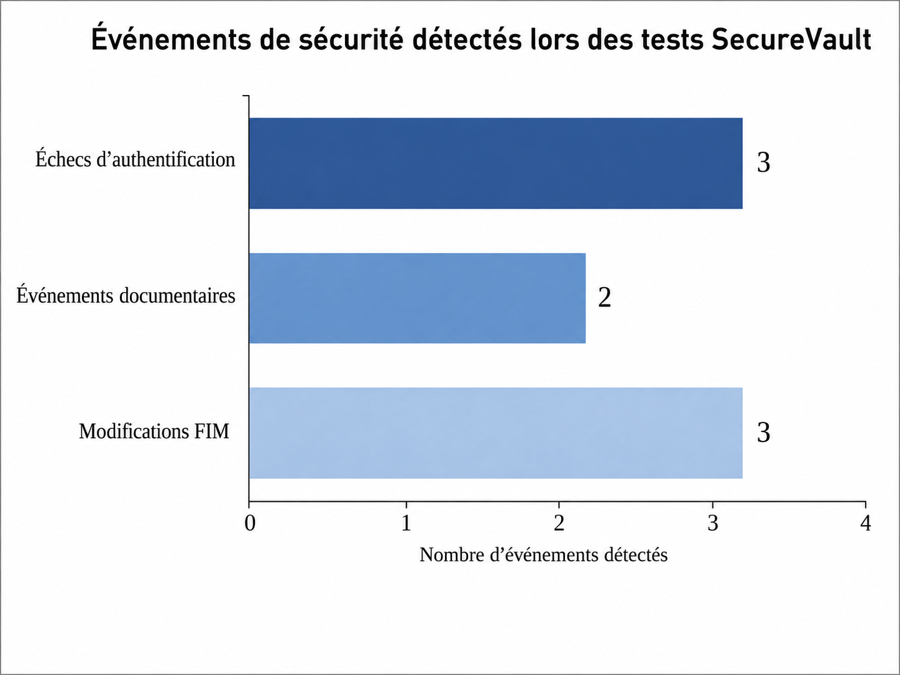
