# Phase 02 Hardening

[All evidence](../README.md) · [Project overview](../../README.md)

Historical lab captures; filenames describe the captured step, not independent proof of its security outcome. Images are preserved at original resolution.

AFTER CIS Level 1 → 6 FAIL

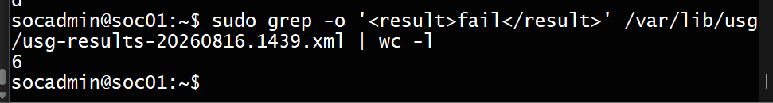

CISSTATUS

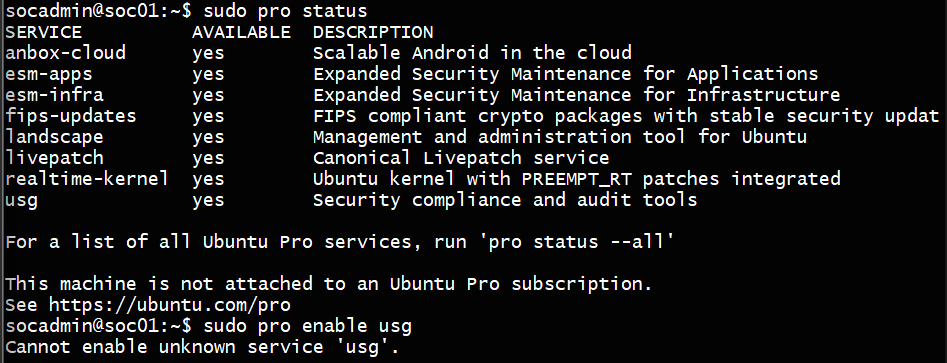

cis_installation_usg

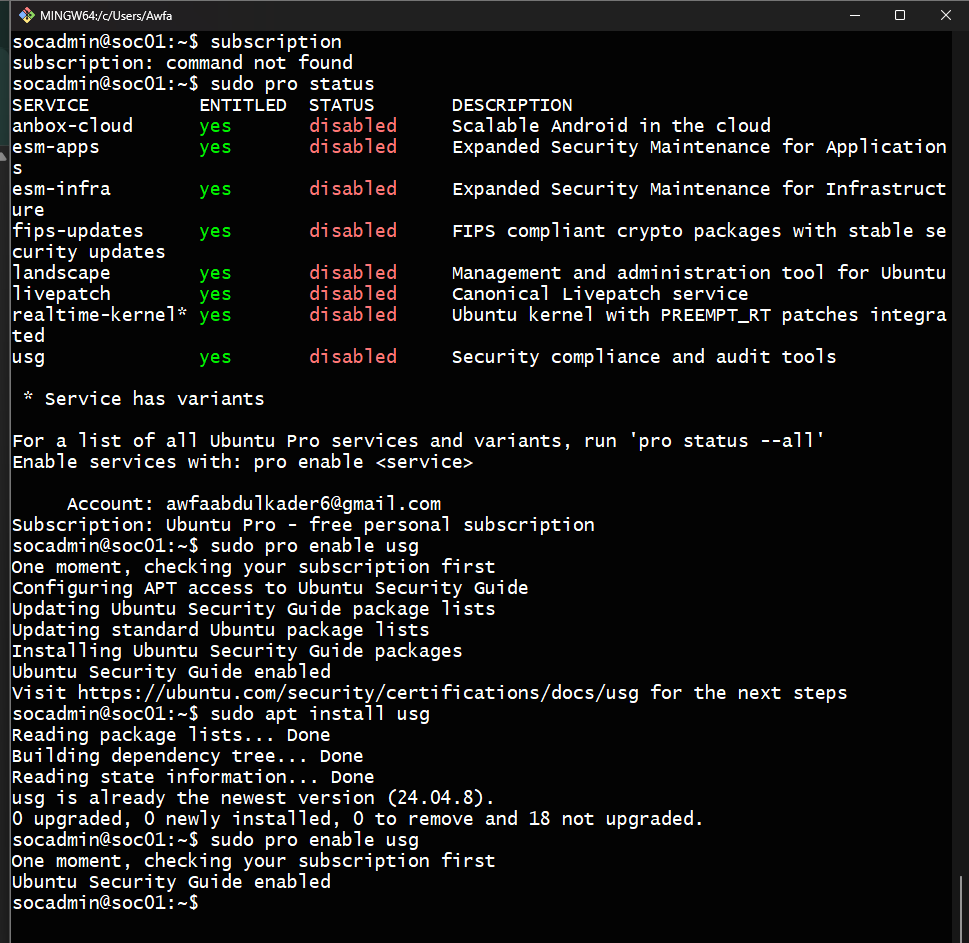

disable ssh

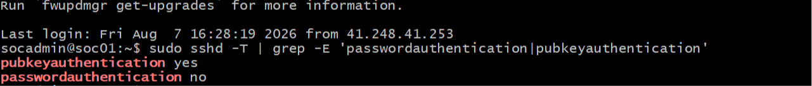

fail2ban

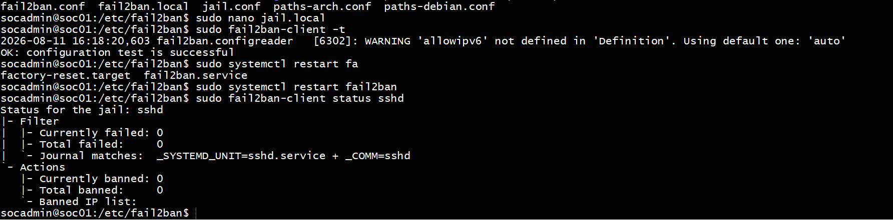

fail2banjaillocal

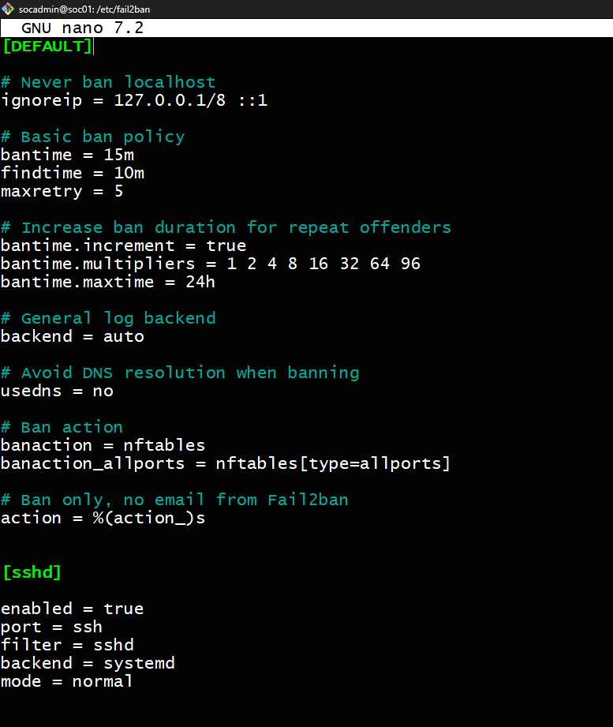

fail2banstatus

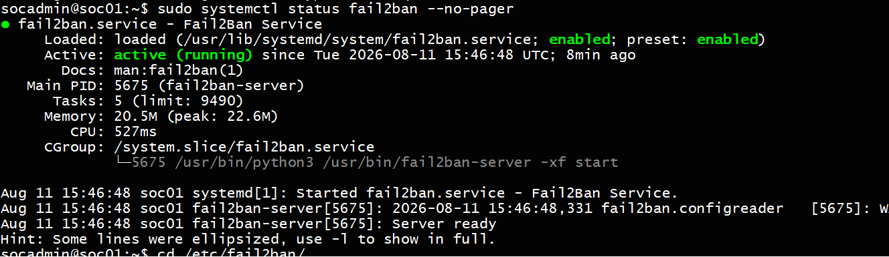

fix_var_log_and_SSH user access restriction

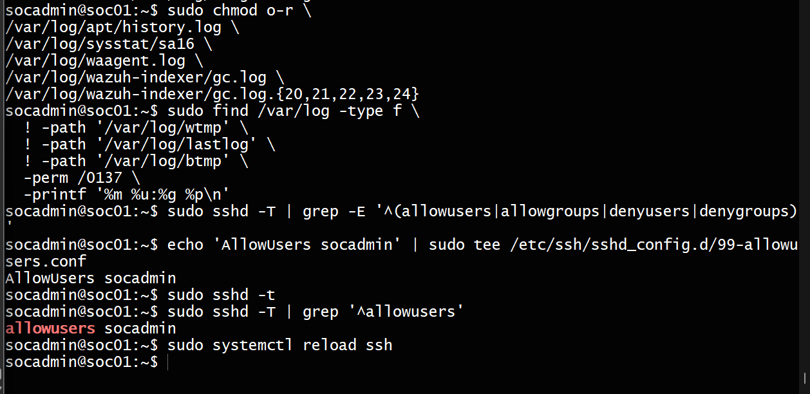

separate tmpfs mountcis

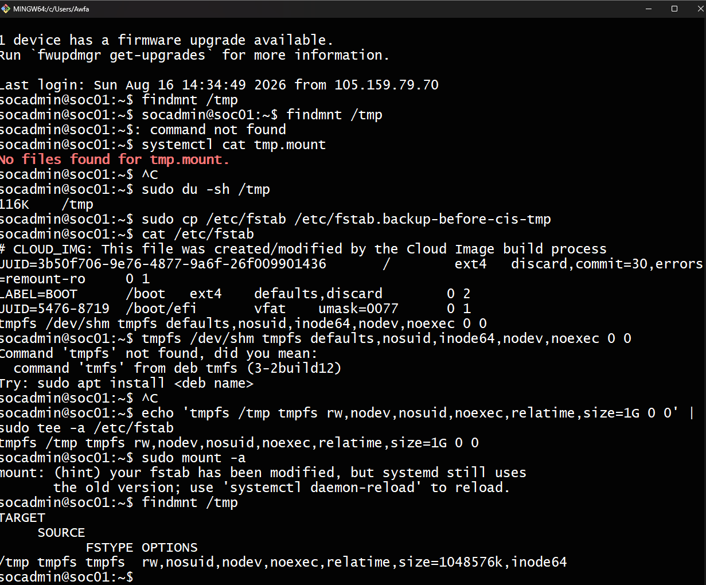

sshtest

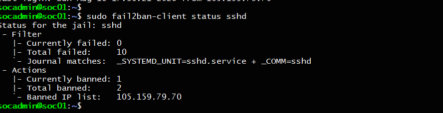

the6cis

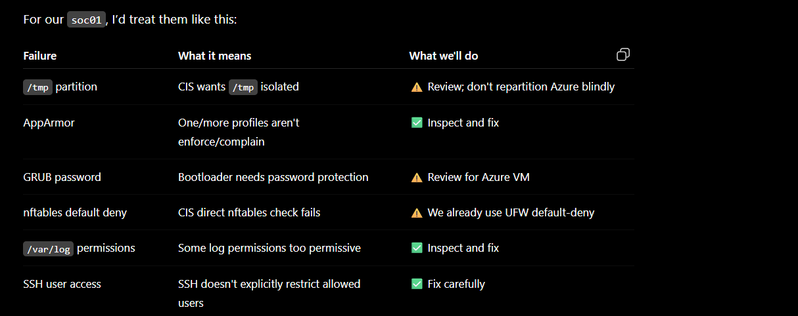

the6inciswhatweneedtofixmanually

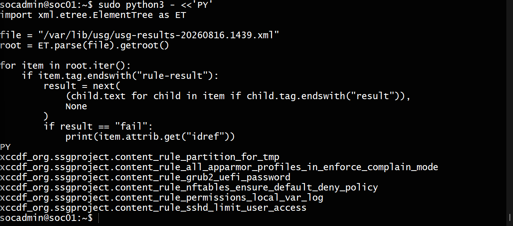

ufw

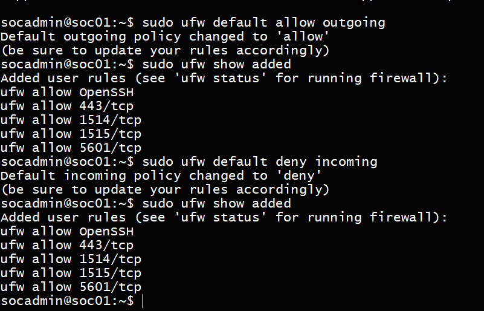

ufw2

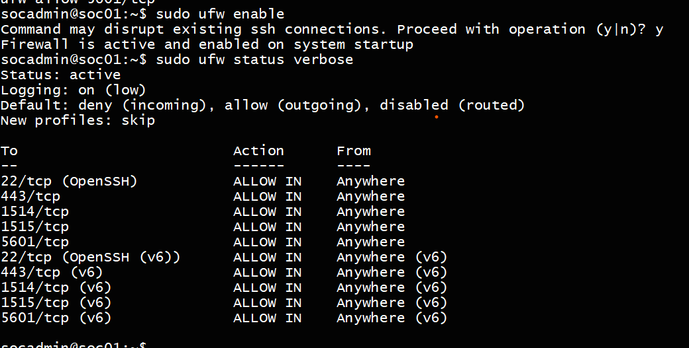

