# Phase 03 Suricata

[All evidence](../README.md) · [Project overview](../../README.md)

Historical lab captures; filenames describe the captured step, not independent proof of its security outcome. Images are preserved at original resolution.

Emerging_Threats_Rules_Installation

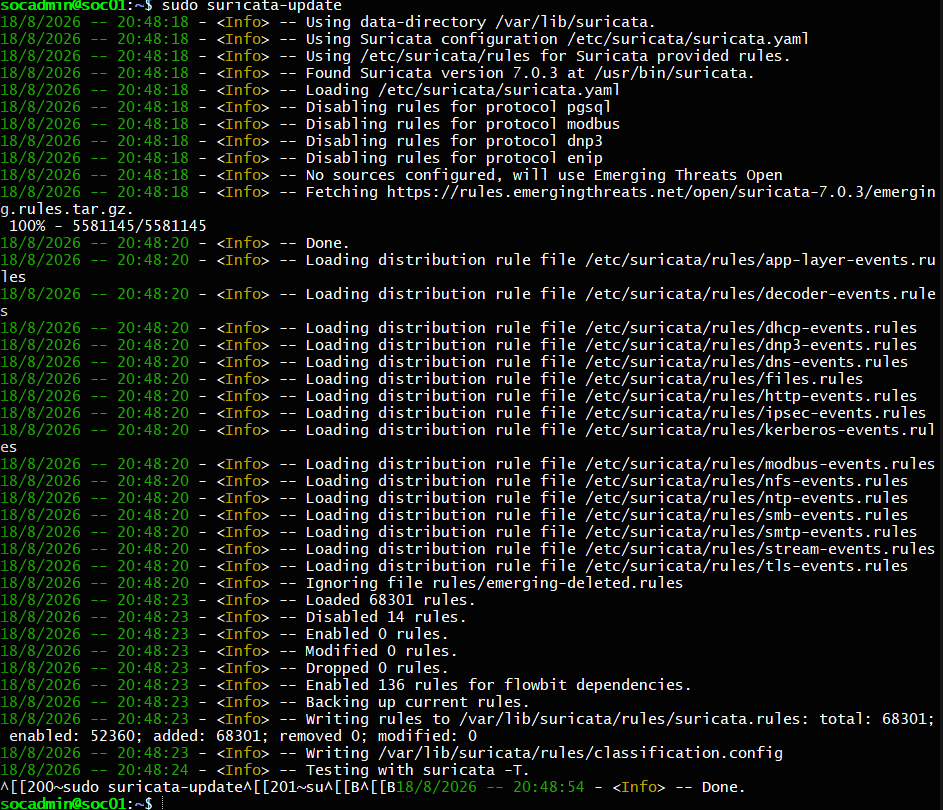

Filebeat_Indexer_Connection_OK

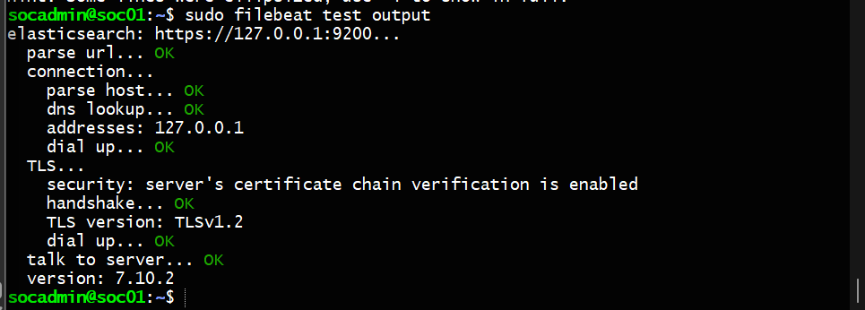

Phase3_Filebeat_Service_Active

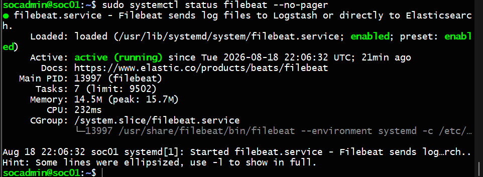

Post_Password_Change_Test_Traffic

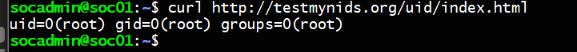

Post_Password_End_to_End_Validation

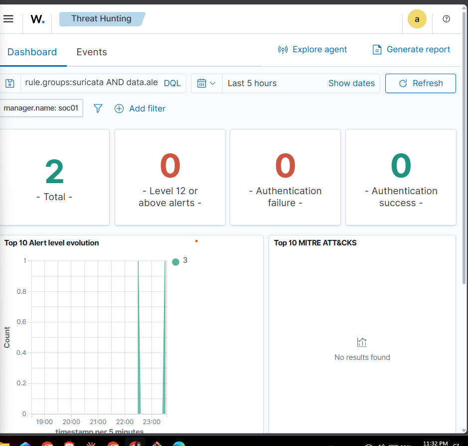

Suricata Network Interface Configuration — eth0

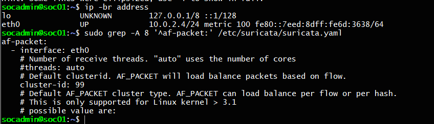

Suricata_Controlled_Alert_2100498

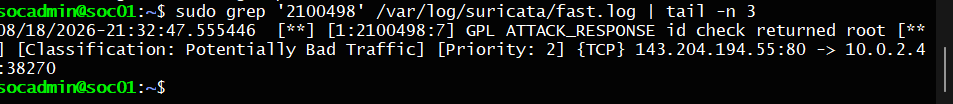

Suricata_Controlled_Test_Traffic

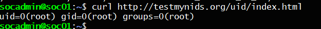

Suricata_EVE_JSON_Events

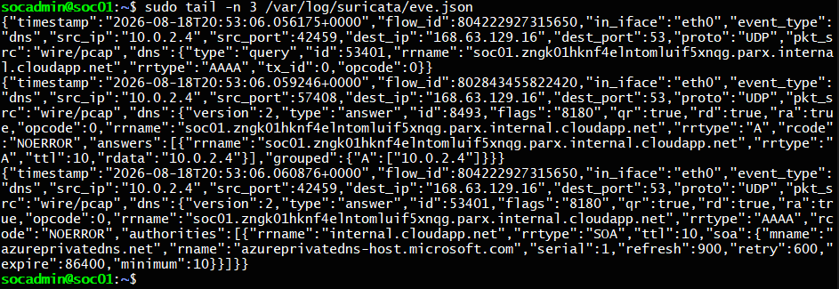

Suricata_No_Rules_Warning

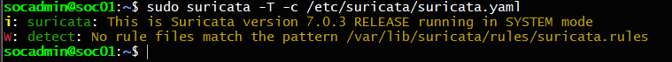

Suricata_Rules_Loaded_Log

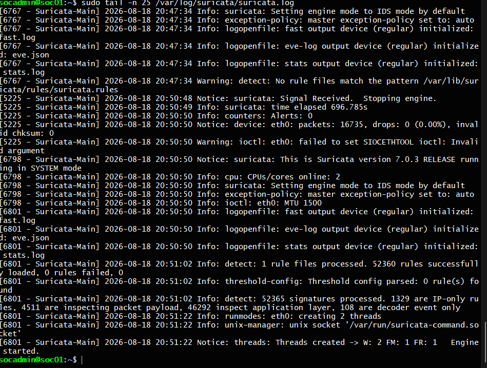

Suricata_Test_Signature_2100498

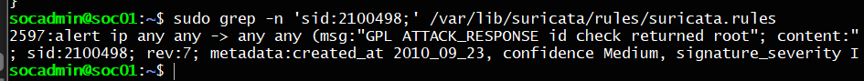

Verification of Suricata HOME_NET Configuration

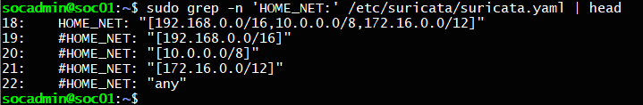

Wazuh_Config_Backup

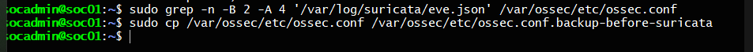

Wazuh_Suricata_EVE_Integration

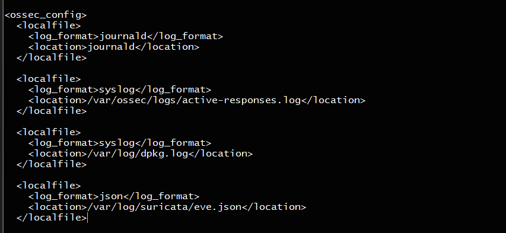

Wazuh_Suricata_Installation_Alert

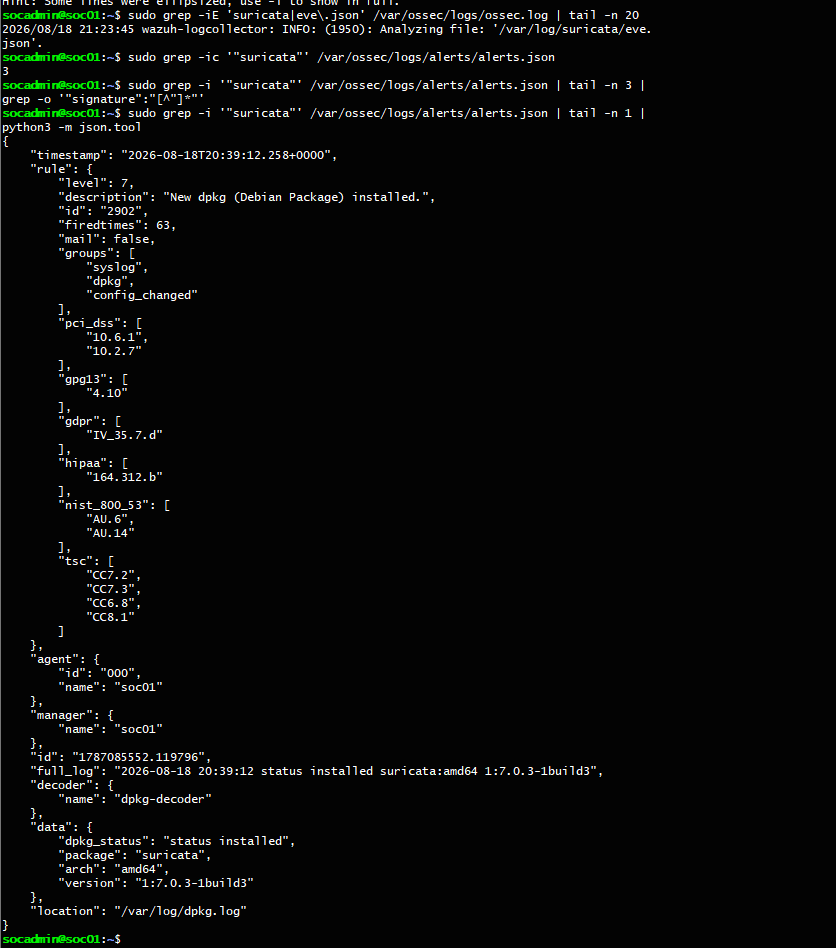

verfysuricata

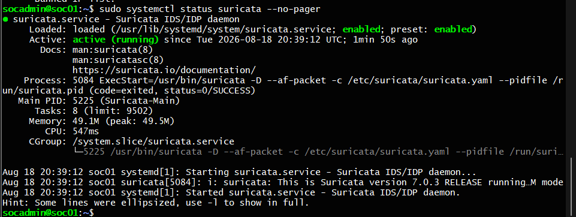

wazuh installed

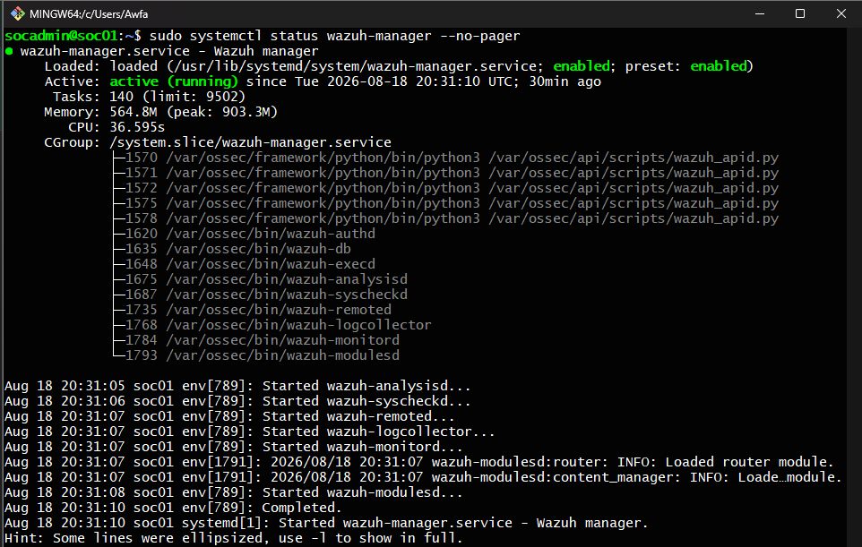

