# Securevault Demo

[All evidence](../README.md) · [Project overview](../../README.md)

Historical lab captures; filenames describe the captured step, not independent proof of its security outcome. Images are preserved at original resolution.

activity

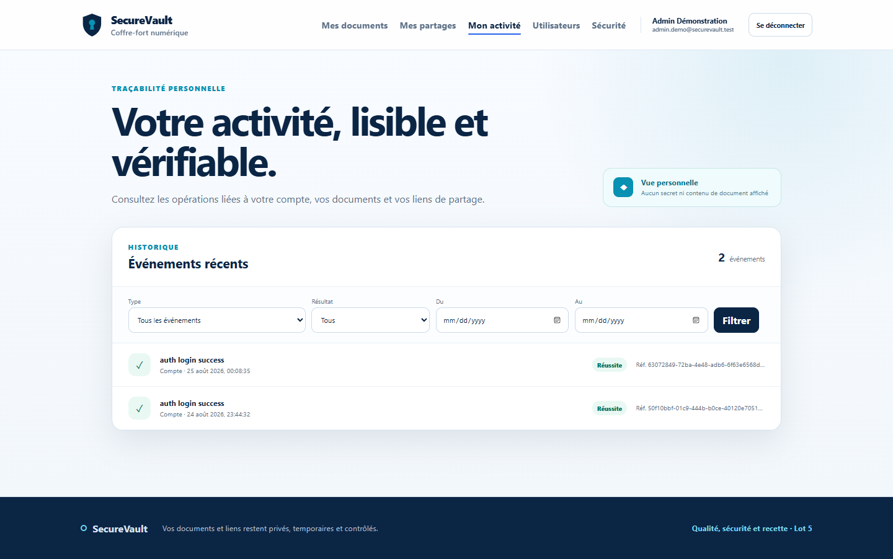

admin-security

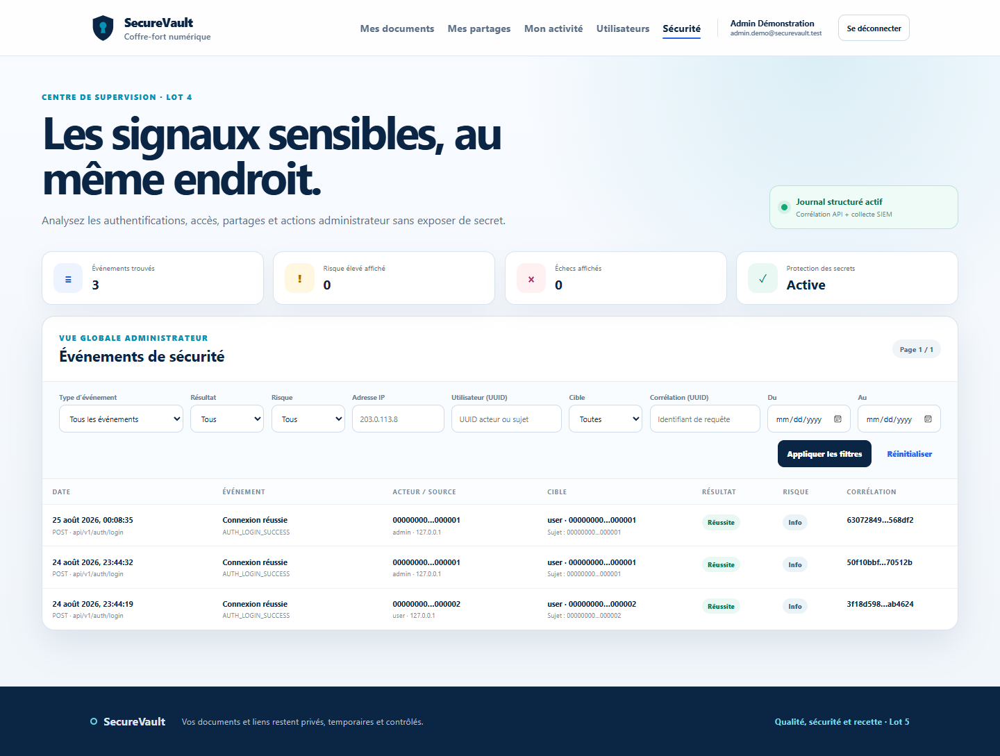

demo-admin-security

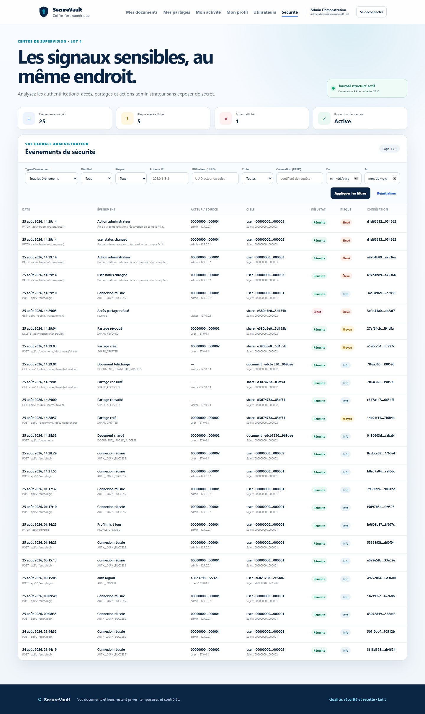

demo-admin-users

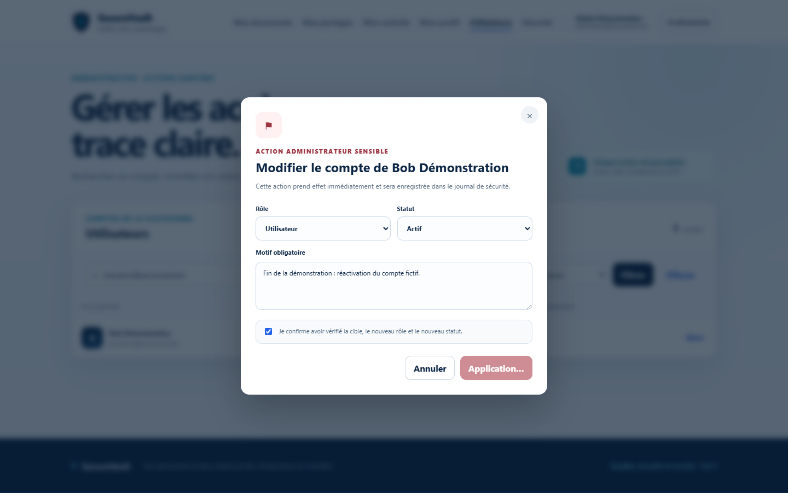

demo-public-share

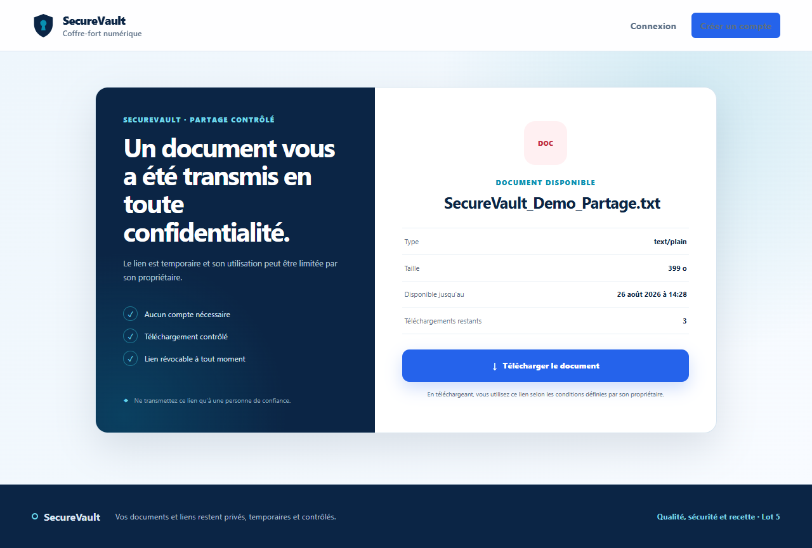

demo-user-activity

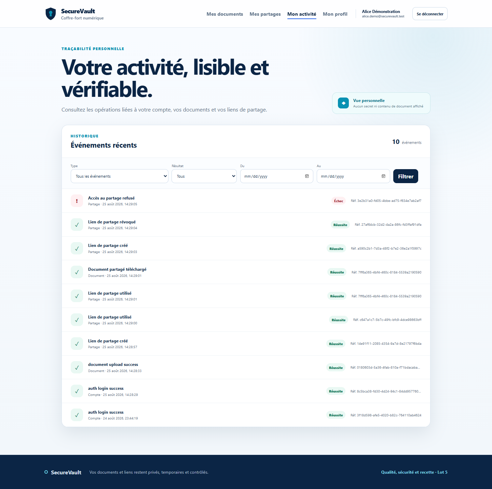

demo-user-documents

demo-user-shares-final

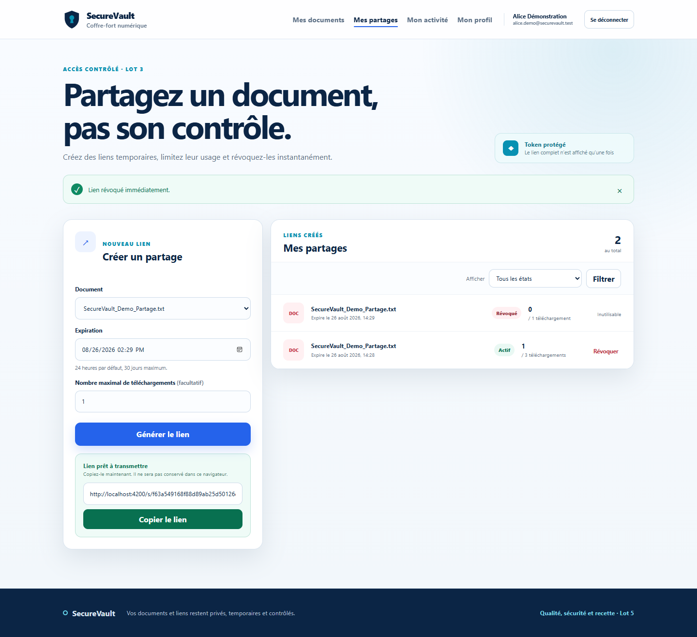

documents

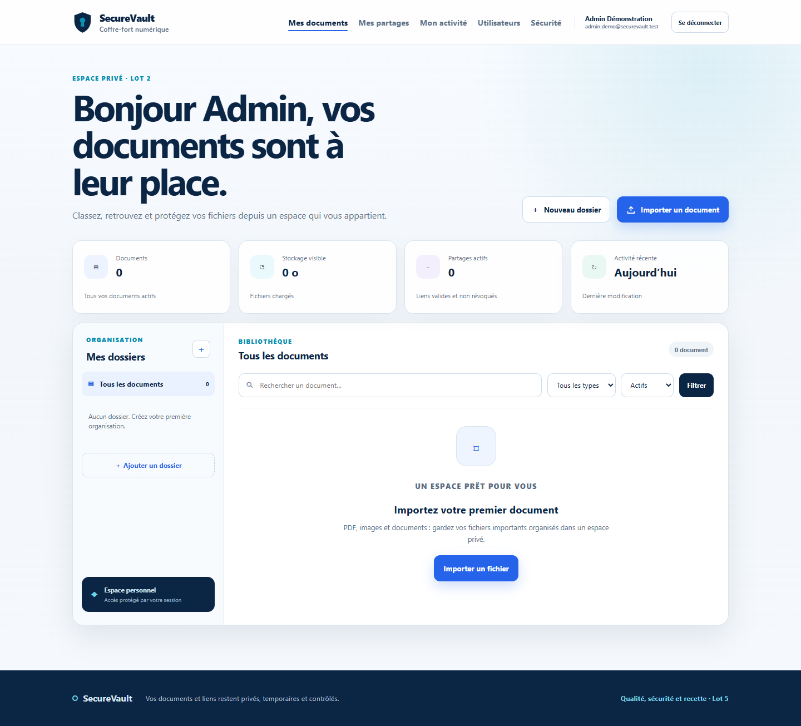

profile-mobile

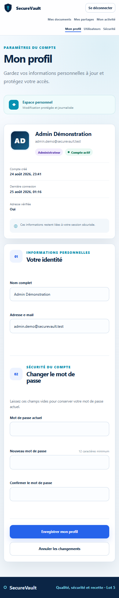

profile

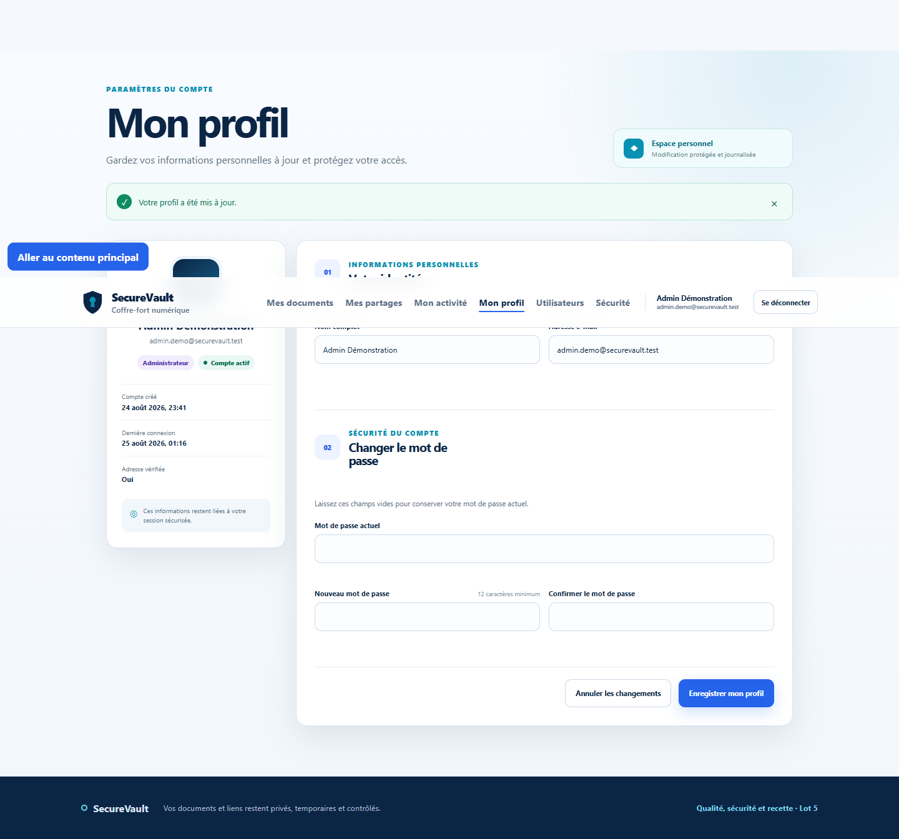

shares

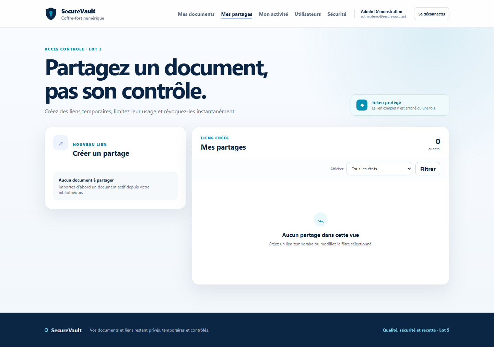

